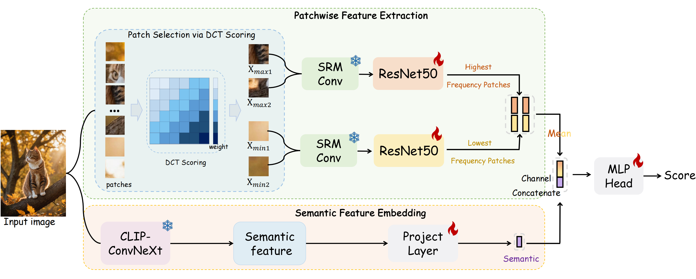

# A Sanity Check for AI-generated Image Detection

Official implementation of ['A Sanity Check for AI-generated Image Detection']().

**[🏠[Homepage]](https://shilinyan99.github.io/AIDE/)** &emsp; **[📄[Paper]]()**

<!-- 

<h1>
<b>
A Sanity Check for AI-generated Image Detection
</b>
</h1>

 -->

## Introduction

We conduct a sanity check on **"whether the task of AI-generated image detection has been solved"**. To start with, we present **Chameleon** dataset, consisting AI-generated images that are genuinely challenging for human perception. To quantify the generalization of existing methods, we evaluate 9 off-the-shelf AI-generated image detectors on **Chameleon** dataset. Upon analysis, almost all models classify AI-generated images as real ones. Later, we propose **AIDE**~(**A**I-generated **I**mage **DE**tector with Hybrid Features), which leverages multiple experts to simultaneously extract visual artifacts and noise patterns. 

## News
* **TODO**: Release the Chamelon dataset.
* 🔥🔥🔥We release the code and checkpoints of AIDE.

## Requirements

We test the codes in the following environments, other versions may also be compatible:

- CUDA 11.3
- Python 3.10
- Pytorch 1.11.0

## Installation

Please refer to [install.md](docs/install.md) for installation.

## Get Started

Please see [Training.md](docs/TRAINING.md) for details.

## Dataset

### Training Set
We adopt the training set in [CNNSpot](https://github.com/peterwang512/CNNDetection) and [GenImage](https://github.com/Andrew-Zhu/GenImage).

### Test Set
The whole test set we used in our experiments can be downloaded from [AIGCDetectBenchmark](https://github.com/Ekko-zn/AIGCDetectBenchmark?tab=readme-ov-file) and [GenImage](https://github.com/Andrew-Zhu/GenImage).

## Model Zoo

Our training checkpoints can be downloaded from [link](https://drive.google.com/drive/folders/1qvUz0MgrVwG1B1ntkUVcRuYY0864jqcy?usp=sharing).

## Acknowledgement

This repo is based on [ConvNeXt](https://github.com/facebookresearch/ConvNeXt-V2). We also refer to the repositories [CNNSpot](https://github.com/peterwang512/CNNDetection)、[AIGCDetectBenchmark](https://github.com/Ekko-zn/AIGCDetectBenchmark?tab=readme-ov-file)、[GenImage](https://github.com/Andrew-Zhu/GenImage) and [DNF](https://github.com/YichiCS/DNF). Thanks for their wonderful works.

## Contact
If you have any question about this project, please feel free to contact tattoo.ysl@gmail.com.
